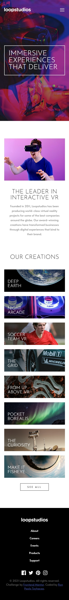
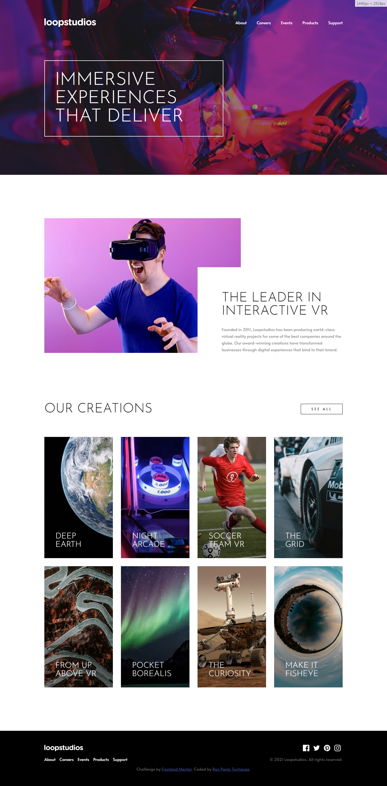

# Frontend Mentor - Loopstudios landing page solution

This is a solution to the [Loopstudios landing page challenge on Frontend Mentor](https://www.frontendmentor.io/challenges/loopstudios-landing-page-N88J5Onjw). Frontend Mentor challenges help you improve your coding skills by building realistic projects. 

## Table of contents

- [Overview](#overview)
  - [The challenge](#the-challenge)
  - [Screenshot](#screenshot)
  - [Links](#links)
- [My process](#my-process)
  - [Built with](#built-with)
  - [What I learned](#what-i-learned)
  - [Continued development](#continued-development)
- [Author](#author)
- [Acknowledgments](#acknowledgments)

## Overview

### The challenge

Users should be able to:

- View the optimal layout for the site depending on their device's screen size
- See hover states for all interactive elements on the page

### Screenshot

#### Mobile


#### Desktop


### Links

- Solution URL: [https://github.com/rontoyhacao/Loopstudios-landing-page](https://github.com/rontoyhacao/Loopstudios-landing-page)
- Live Site URL: [https://loopstudios-landing-page-git-main-rontoyhacao.vercel.app/](https://loopstudios-landing-page-git-main-rontoyhacao.vercel.app/)

## My process

### Built with

- Semantic HTML5 markup
- CSS custom properties
- [Sass](https://sass-lang.com/)
- Javascript
- Flexbox
- CSS Grid
- Mobile-first workflow

### What I learned

I was able to practice my layout skills once again through this project. I used CSS Grid on the creations section and that let me understand CSS Grid more. I also learned how to make a full view navigation on mobile in this project by using the `vh` and `vw` units in CSS. I was also able to learn how to make an overlay layout on the second section of the page which has an image of a man. Instead of using `absolute` position, I used `margin-left` property with a negative value.

```css
.interactive-content {
  padding: 6rem 0 0 6rem !important;
  margin-left: -14rem;
  background: $White;
  min-height: 19rem;
  text-align: initial !important;
  p {
    padding: 0 !important;
    margin: 2rem 0 0 !important;
  }
}
```

## Author

- Website - [Ron Paolo Toyhacao](https://www.your-site.com)
- Frontend Mentor - [@rontoyhacao](https://www.frontendmentor.io/profile/rontoyhacao)
- Twitter - [@rontoyhacao](https://twitter.com/rontoyhacao)

## Acknowledgments

I would like to thank and give acknowledgement to [@pikamart](https://www.frontendmentor.io/profile/pikamart) from Front-end Mentor for his solution as my reference to pull off the full view navigation on mobile. This made me understand how to make one and apply it to my future projects.
